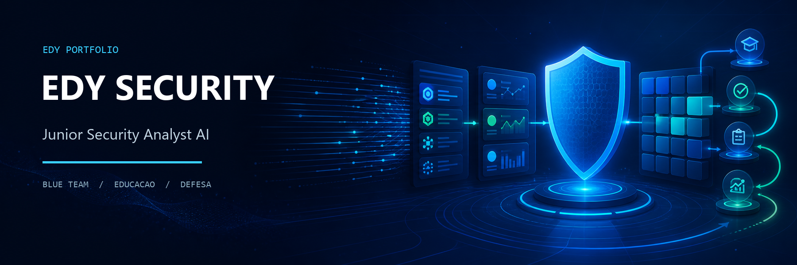
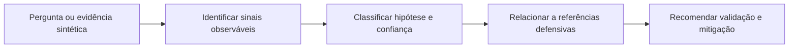

# EDY Security — Junior Security Analyst AI

Projeto de estudo que define um assistente educacional para fundamentos de Blue Team, conscientização de segurança e análise defensiva guiada.

    

## Objetivo

O EDY Security ajuda estudantes e profissionais iniciantes a organizar uma primeira análise de logs, mensagens suspeitas e vulnerabilidades conhecidas. O conteúdo prioriza explicações claras, evidências observáveis e recomendações defensivas.

Este repositório contém prompts, exemplos e documentação. Não há uma aplicação, modelo próprio, integração com SIEM ou automação executável publicada nesta versão.

## Capacidades documentadas

- triagem inicial de eventos de log fictícios;
- identificação de sinais comuns de phishing;
- explicação de vulnerabilidades e mitigações;
- correlação educacional com OWASP, MITRE ATT&CK e NIST CSF;
- recomendações de hardening e próximos passos verificáveis;
- comunicação adequada para quem está começando em segurança.

## Fluxo de análise



## Materiais

| Recurso | Conteúdo |
|---|---|
| [Prompt do agente](prompts/edy-security-system-prompt.md) | Papel, missão, capacidades e limites |
| [Arquitetura](docs/architecture.md) | Componentes conceituais do assistente |
| [Fluxo](docs/workflow.md) | Etapas de uma resposta defensiva |
| [Casos de uso](docs/use-cases.md) | Logs, phishing, vulnerabilidades e conscientização |
| [Exemplo de logs](examples/log-analysis.md) | Triagem de eventos fictícios |
| [Exemplo de phishing](examples/phishing.md) | Sinais e ações recomendadas |
| [Exemplo de vulnerabilidade](examples/vulnerability-explanation.md) | Explicação e mitigação de SQL Injection |

## Uso responsável

- use apenas dados próprios, fictícios ou devidamente autorizados;
- remova nomes, e-mails, IPs privados, tokens e identificadores antes de compartilhar exemplos;
- trate a resposta como apoio educacional, não como veredito automático;
- confirme técnicas e controles nas fontes oficiais;
- não use o material para acesso não autorizado, malware ou evasão de controles.

## Estrutura

```text
docs/
├── assets/edy-security-banner.png
├── architecture.md
├── use-cases.md
└── workflow.md
examples/
├── log-analysis.md
├── phishing.md
└── vulnerability-explanation.md
prompts/
└── edy-security-system-prompt.md
AGENTS.md
LICENSE
README.md
```

## Roadmap

- [x] definição do papel e das restrições;
- [x] documentação e exemplos sintéticos;
- [x] organização do material para Windows e GitHub;
- [ ] base de conhecimento versionada com referências oficiais;
- [ ] testes de qualidade dos prompts;
- [ ] protótipo local com dados exclusivamente sintéticos.

## Autor e licença

**Edmilson Gomes de Sousa** — [GitHub @EDY075](https://github.com/EDY075)

Distribuído sob a [Licença MIT](LICENSE).
